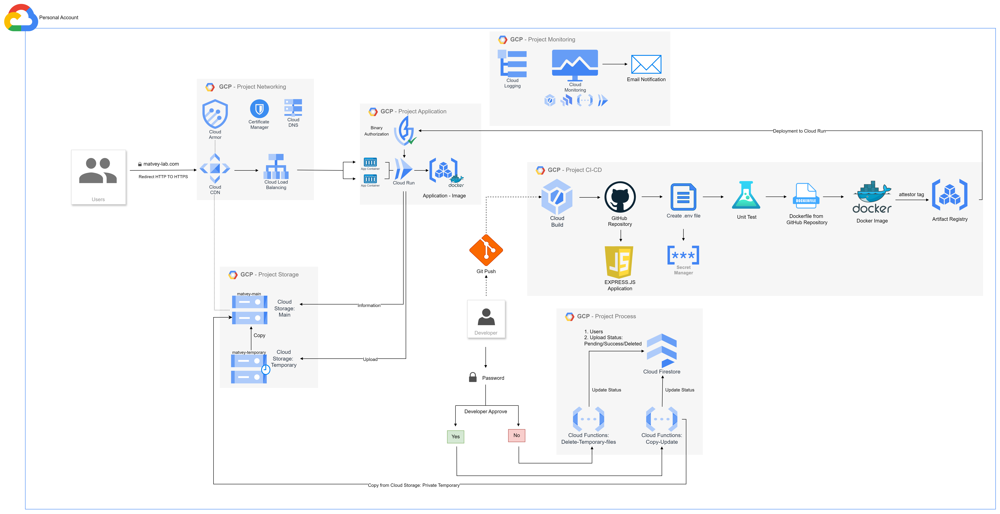

# GCP-Project

```
# Install Express.js
npm init -y
npm install express bcryptjs jsonwebtoken mongoose @google-cloud/storage
npm install ejs
npm install multer
```

```
# Allow to Cloud Functions access to everyone
gcloud functions add-invoker-policy-binding function-copy --region="europe-west3" --member="allUsers"
gcloud functions add-invoker-policy-binding function-delete --region="europe-west3" --member="allUsers"
```

```
# Artifact Registry
gcloud auth configure-docker europe-west3-docker.pkg.dev
docker tag app-gcp:V1.0 europe-west3-docker.pkg.dev/networking-438508/app-gcp/app-gcp:V1.0
docker push europe-west3-docker.pkg.dev/networking-438508/app-gcp/app-gcp:V1.0
```

